# 5-Linear-Regression
1. [Linear Regression Theory and Reading](#schema1)
2. [Linear Regression Documentacion Example](#schema2)
3. [Regression Evaluation](#schema3)
4. [Linear Regression Example](#schema4)


<hr>

<a name="schema1"></a>

## 1. Linear Regression Theory and Reading
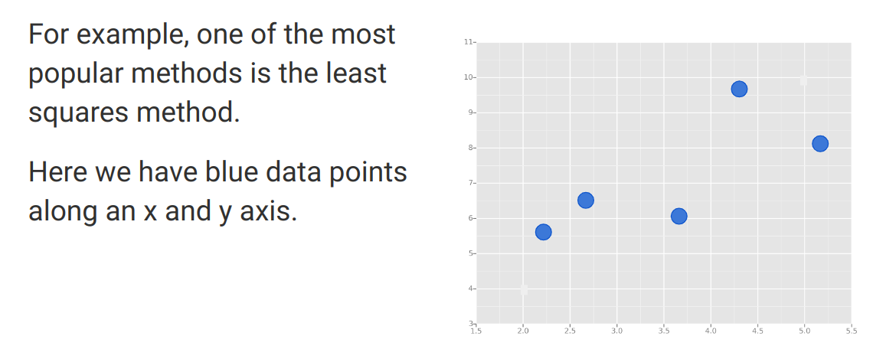
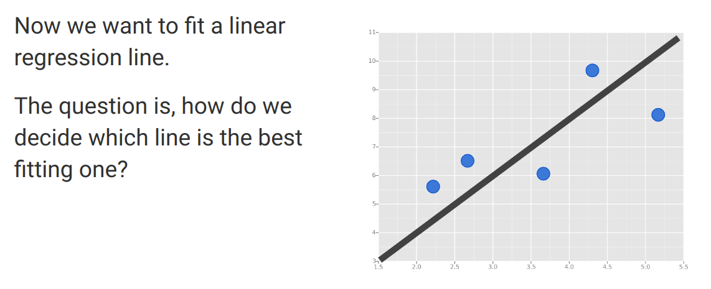
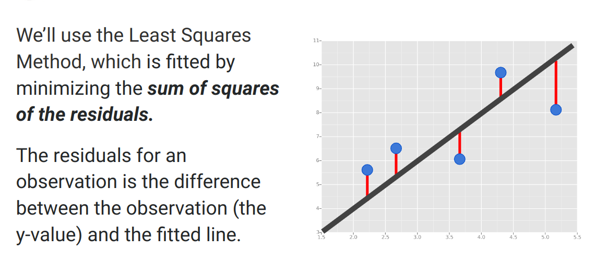

<hr>

<a name="schema2"></a>


## 2  Linear Regression Documentacion Example

- Importar Librerias
```
from pyspark.ml.regression import LinearRegression
```

- These are the default values for the featuresCol, labelCol, predictionCol
```
lr = LinearRegression(featuresCol='features', labelCol='label', predictionCol='prediction')
```

- Fit the model

```
lrModel = lr.fit(training)
```
- Print the coefficients and intercept for linear regression

```
print("Coefficients: {}".format(str(lrModel.coefficients))) # For each feature...
print('\n')
print("Intercept:{}".format(str(lrModel.intercept)))

```
-  Summarize the model over the training set and print out some metrics
```

trainingSummary = lrModel.summary
trainingSummary.residuals.show()
print("RMSE: {}".format(trainingSummary.rootMeanSquaredError))
print("r2: {}".format(trainingSummary.r2))

+-------------------+
|          residuals|
+-------------------+
|-11.011130022096554|
| 0.9236590911176537|
|-4.5957401897776675|
|  -20.4201774575836|
|-10.339160314788181|
|-5.9552091439610555|
|-10.726906349283922|
|  2.122807193191233|
|  4.077122222293812|
|-17.316168071241652|
|-4.5930443439590585|
|  6.380476690746936|
| 11.320566035059846|
|-20.721971774534094|
| -2.736692773777402|
|-16.668869342528467|
|  8.242186378876315|
|-1.3723486332690227|
|-0.7060332131264666|
| -1.159113596999406|
+-------------------+
only showing top 20 rows

RMSE: 10.16309157133015
r2: 0.027839179518600154
```

- ## Train/Test Splits
But wait! We've commited a big mistake, we never separated our data set into a training and test set. 
Instead we trained on ALL of the data, something we generally want to avoid doing. 
Read ISLR and check out the theory lecture for more info on this, but remember we won't get a fair evaluation 
of our model by judging how well it does again on the same data it was trained on!

Luckily Spark DataFrames have an almost too convienent method of splitting the data! Let's see it:


```
all_data = spark.read.format("libsvm").load("sample_linear_regression_data.txt")
# Pass in the split between training/test as a list.
# No correct, but generally 70/30 or 60/40 splits are used. 
# Depending on how much data you have and how unbalanced it is.
train_data,test_data = all_data.randomSplit([0.7,0.3])

```
Well that is nice, but realistically we will eventually want to test this model against unlabeled data, after all, 
that is the whole point of building the model in the first place. We can again do this with a convenient method call,
in this case, transform(). Which was actually being called within the evaluate() method.

```
unlabeled_data = test_data.select('features')
unlabeled_data.show()
+--------------------+
|            features|
+--------------------+
|(10,[0,1,2,3,4,5,...|
|(10,[0,1,2,3,4,5,...|
|(10,[0,1,2,3,4,5,...|
|(10,[0,1,2,3,4,5,...|
|(10,[0,1,2,3,4,5,...|
|(10,[0,1,2,3,4,5,...|
|(10,[0,1,2,3,4,5,...|
|(10,[0,1,2,3,4,5,...|
|(10,[0,1,2,3,4,5,...|
|(10,[0,1,2,3,4,5,...|
|(10,[0,1,2,3,4,5,...|
|(10,[0,1,2,3,4,5,...|
|(10,[0,1,2,3,4,5,...|
|(10,[0,1,2,3,4,5,...|
|(10,[0,1,2,3,4,5,...|
|(10,[0,1,2,3,4,5,...|
|(10,[0,1,2,3,4,5,...|
|(10,[0,1,2,3,4,5,...|
|(10,[0,1,2,3,4,5,...|
|(10,[0,1,2,3,4,5,...|
+--------------------+
only showing top 20 rows
```

```
predictions = correct_model.transform(unlabeled_data)
predictions.show()
+--------------------+-------------------+
|            features|         prediction|
+--------------------+-------------------+
|(10,[0,1,2,3,4,5,...|-2.3489066454981704|
|(10,[0,1,2,3,4,5,...|  3.714535428017714|
|(10,[0,1,2,3,4,5,...|-2.6108166882407486|
|(10,[0,1,2,3,4,5,...| 1.5144298158221856|
|(10,[0,1,2,3,4,5,...| 1.8697846885645713|
|(10,[0,1,2,3,4,5,...| 2.6007968854595065|
|(10,[0,1,2,3,4,5,...|-1.1723765812697016|
|(10,[0,1,2,3,4,5,...| 1.9567321151464427|
|(10,[0,1,2,3,4,5,...| 0.6102575262398926|
|(10,[0,1,2,3,4,5,...| 2.6508959410190136|
|(10,[0,1,2,3,4,5,...|  2.540875761868542|
|(10,[0,1,2,3,4,5,...|  5.494874057315457|
|(10,[0,1,2,3,4,5,...|-1.7233993188619425|
|(10,[0,1,2,3,4,5,...| 4.1184648670546835|
|(10,[0,1,2,3,4,5,...| -4.552087224892758|
|(10,[0,1,2,3,4,5,...| -2.683051677477573|
|(10,[0,1,2,3,4,5,...|-1.3403514853350316|
|(10,[0,1,2,3,4,5,...|  4.737198157943087|
|(10,[0,1,2,3,4,5,...| 2.8409382435346093|
|(10,[0,1,2,3,4,5,...|  3.581619092800813|
+--------------------+-------------------+
only showing top 20 rows

```
Okay, so this data is a bit meaningless, so let's explore this same process with some data that actually 
makes a little more intuitive sense!


<hr>

<a name="schema3"></a>

## 3. Regression Evaluation
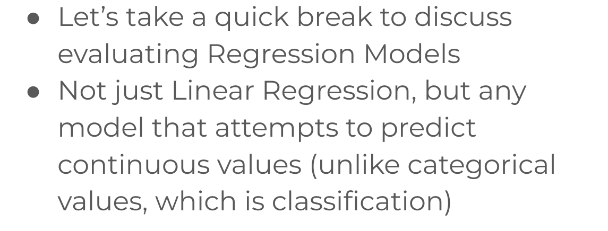

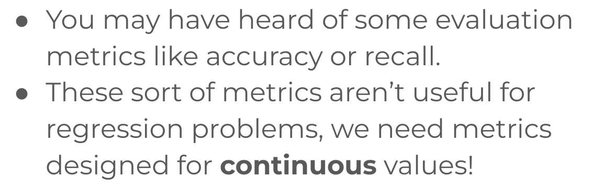

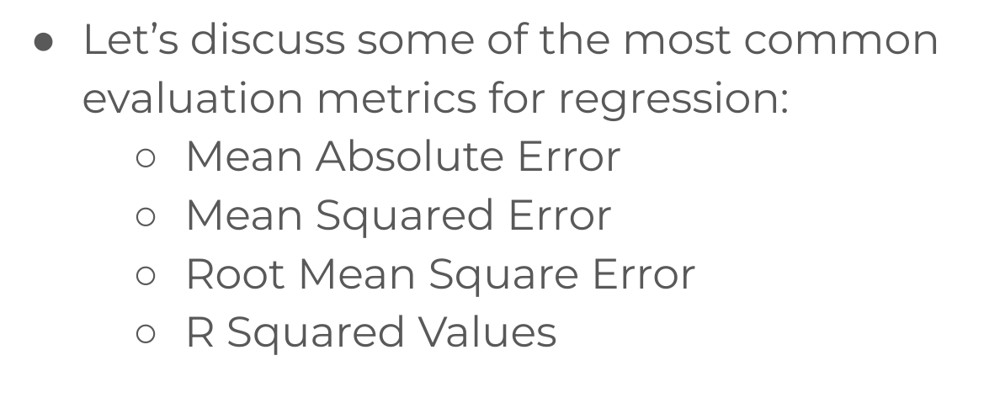
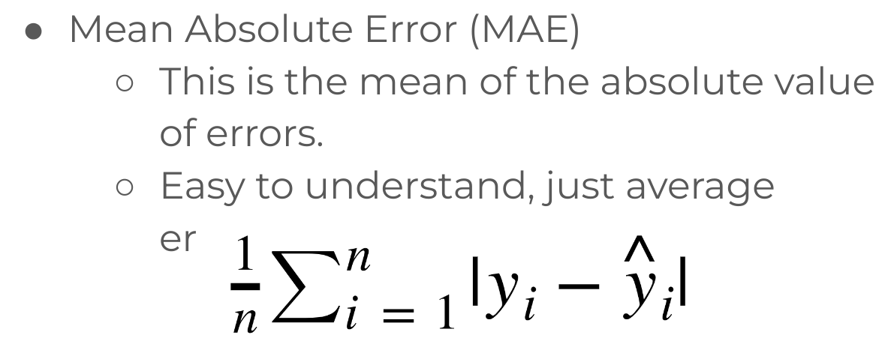
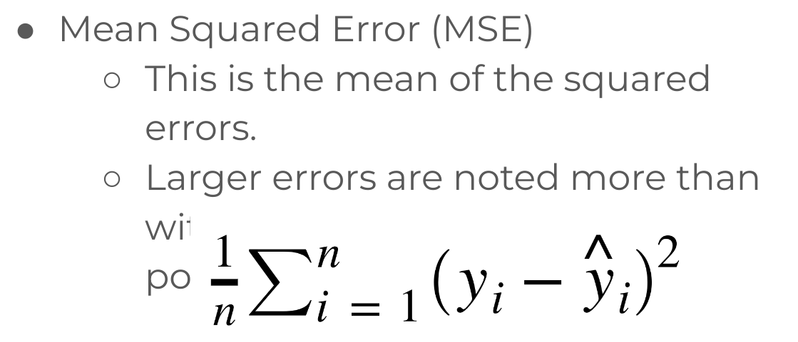
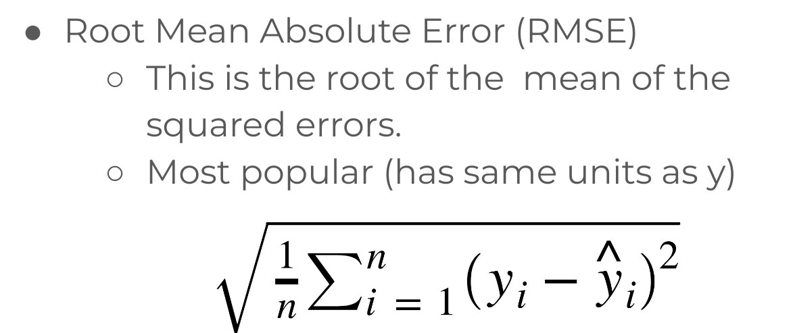
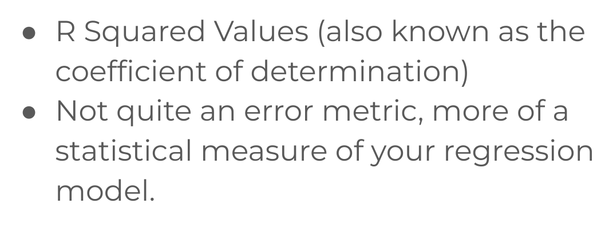
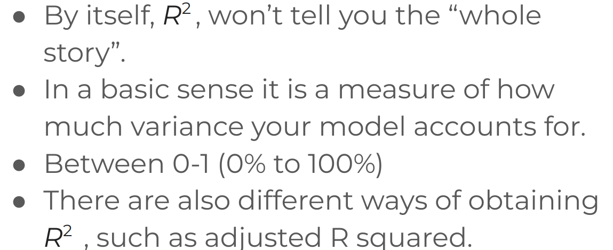

<hr>

<a name="schema4"></a>

## 4. Linear Regression Example
- Importamos librerias
```
from pyspark.ml.linalg import Vectors
from pyspark.ml.feature import VectorAssembler
```
- Creamos `assemlber`
```
assembler = VectorAssembler(inputCols = ['Avg Session Length','Time on App','Time on Website',
                                          'Length of Membership'],outputCol= 'features')
```
- Transformamos lo datos
```
output = assembler.transform(data)
Row(Email='mstephenson@fernandez.com', Address='835 Frank TunnelWrightmouth, MI 82180-9605', Avatar='Violet', 
Avg Session Length=34.49726772511229, Time on App=12.65565114916675, Time on Website=39.57766801952616, 
Length of Membership=4.0826206329529615, Yearly Amount Spent=587.9510539684005, 
features=DenseVector([34.4973, 12.6557, 39.5777, 4.0826]))

final_data = output.select('features','Yearly Amount Spent')
final_data.show()
+--------------------+-------------------+
|            features|Yearly Amount Spent|
+--------------------+-------------------+
|[34.4972677251122...|  587.9510539684005|
|[31.9262720263601...|  392.2049334443264|
|[33.0009147556426...| 487.54750486747207|
|[34.3055566297555...|  581.8523440352177|
|[33.3306725236463...|  599.4060920457634|
|[33.8710378793419...|   637.102447915074|
|[32.0215955013870...|  521.5721747578274|
|[32.7391429383803...|  549.9041461052942|
|[33.9877728956856...|  570.2004089636196|
|[31.9365486184489...|  427.1993848953282|
|[33.9925727749537...|  492.6060127179966|
|[33.8793608248049...|  522.3374046069357|
|[29.5324289670579...|  408.6403510726275|
|[33.1903340437226...|  573.4158673313865|
|[32.3879758531538...|  470.4527333009554|
|[30.7377203726281...|  461.7807421962299|
|[32.1253868972878...| 457.84769594494855|
|[32.3388993230671...| 407.70454754954415|
|[32.1878120459321...|  452.3156754800354|
|[32.6178560628234...|   605.061038804892|
+--------------------+-------------------+
only showing top 20 rows
```
- Split los datos
```
train_data,test_data = final_data.randomSplit([0.7,0.3])
```
- Creamos la lr, entrenamos con los datos de entrenamiento `train_data` y evaluamos con los datos de test `test_data`
```
lr = LinearRegression(labelCol = 'Yearly Amount Spent')
lr_model = lr.fit(train_data)
test_results = lr_model.evaluate(test_data)
```

- Residuals son la dieferencia entre el valor predicho y en valor de test_data.
``
test_results.residuals.show()
+-------------------+
|          residuals|
+-------------------+
| 10.104412520986443|
|-3.9633767118586434|
|-21.482702771722074|
| 18.235885761169186|
| 3.6472162443516254|
|0.21055841952920673|
| -8.268715642350458|
|   -5.7267730802713|
| -4.041106092661778|
|-0.7799654811047958|
| -8.157202540250069|
| -6.107007251806351|
|-11.661247404671258|
|-17.656972319494855|
|-1.9811088759401514|
|  1.241116018237335|
|  8.541385674374226|
|-2.5720811380924715|
| -6.746793838014241|
|  17.40926163371296|
+-------------------+
only showing top 20 rows
```